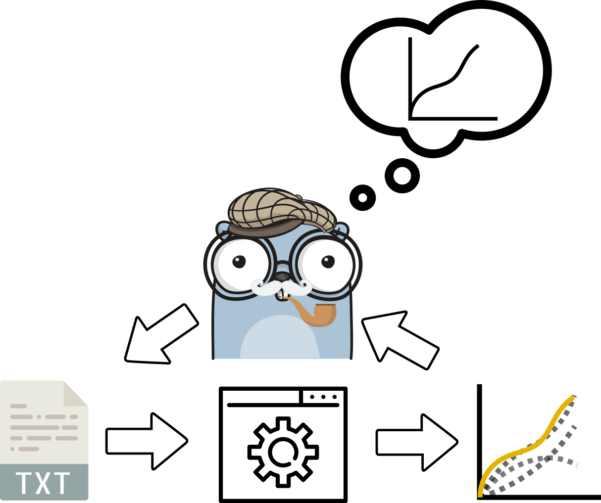
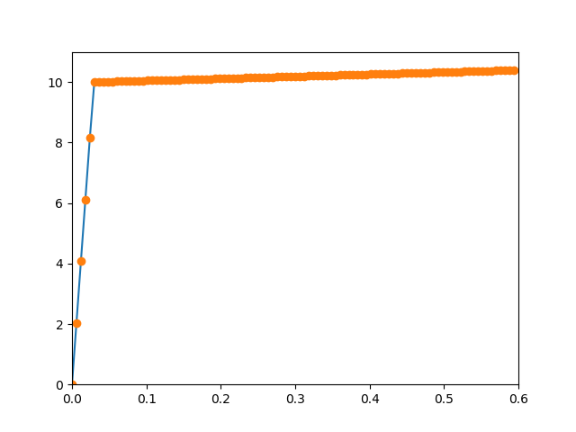
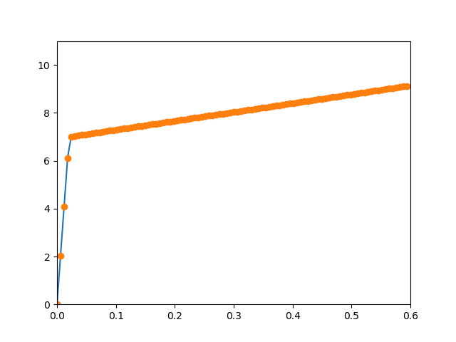

<!-- PROJECT SHIELDS -->
[![MIT License][license-shield]][license-url]
[](https://travis-ci.org/PolymerGuy/golmes)
[](https://codecov.io/gh/PolymerGuy/golmes)
[](https://goreportcard.com/report/github.com/PolymerGuy/golmes)
[](http://godoc.org/github.com/PolymerGuy/golmes)


<!-- PROJECT LOGO -->
<br />
<p align="center">
  <a href="https://github.com/othneildrew/Best-README-Template">
    
  </a>

  <h3 align="center">Golmes</h3>

  <p align="center">
    A simple tool for multi-variate optimization
    <br />
    <a href="https://github.com/othneildrew/Best-README-Template"><strong>Explore the docs »</strong></a>
    <br />
    <br />
    <a href="https://github.com/othneildrew/Best-README-Template">View Demo</a>
    ·
    <a href="https://github.com/othneildrew/Best-README-Template/issues">Report Bug</a>
    ·
    <a href="https://github.com/othneildrew/Best-README-Template/issues">Request Feature</a>
  </p>
</p>


## Status
This code has very rough edges at the moment and is not ready for use in the current state.


<!-- TABLE OF CONTENTS -->
## Table of Contents

- [Table of Contents](#table-of-contents)
- [About The Project](#about-the-project)
  - [Built With](#built-with)
- [Getting Started](#getting-started)
  - [Prerequisites](#prerequisites)
  - [Installation using Go get](#installation-using-go-get)
- [Usage](#usage)
- [Contributing](#contributing)
- [License](#license)
- [Contact](#contact)
- [Acknowledgements](#acknowledgements)


<!-- ABOUT THE PROJECT -->
## About The Project


When you wish to find the input parameters that makes simulation respond in a certain way, this tool may help you.

This tool can be used for doing parametric optimization on any software that supports input-files. 
We do this by making a template input file where keywords will be
replaced by the optimization variables.

The input-file is then generates from the template and passed into a pipeline defined by a series of commands.

The output from the software is then parsed and compared to the desired response. Based on how well the results match the desired ones, the loop is repeated using new parameters.

The algorithms included in this software are not the fanciest you will find, but are proven general purpose algorithms.

A model based approach is used where the function to be minimized is approximated by means of radial basis interpolation.

This project is a composition of the wonderfull works of other people and I am just providing the infrastructure. See the following for a list of nice projects:

### Built With

* [Gonum](https://github.com/gonum)
* [Yamlparser](https://github.com/go-yaml/yaml)
* [CLI](https://github.com/urfave/cli)


<!-- GETTING STARTED -->
## Getting Started

You can obtain this application in two ways:

* Download a pre-compiled binary from [here](#release)
* Compile the source code 

### Prerequisites

Install the golang compiler
* snap
```sh
snap install go
```
* apt
```sh
sudo apt install golang
```
or download directly from the golang homepage

### Installation using Go get

1. Open a terminal and type:
```sh
go get https://github.com/PolymerGuy/golmes.git
go install golmes
```


<!-- USAGE EXAMPLES -->
## Usage
As an example, we will use a mysterious mock application which takes two variables from a input file, runs an simulation and returns a series of data. We will try to find the input variables which gives the best match to a user specified data series.

The input file looks like this:
```sh
# Input file
val1
val2
```
we now substitute val1 and val2 by some floats like this
```sh
# Input file
10.
0.7
```

and run the application like this:
```sh
./sim inputfile.txt
```

a file named inputfile_res.txt is returned and contains the following:
```sh
strain,stress
0e+00,0e+00
6e-03,2.04e+00
1.2e-02,4.08e+00
1.8e-02,6.12e+00
2.4e-02,8.16e+00
...
```

and if we plot this data:


Let us now pretend that we are looking for the arguments which corresponds to the following data stored in a reference.csv file:



We can do this by help of Mr. Golmes.
In order to define an optimization job, we have to fill in an yaml template:
```sh
#job.yaml
Solver_settings:
  method: Nelder-Mea
  threshold: 1e-2
  evaluations: 50

application_settings:
  cmd: ./sim
  flags: 
  inputfile: inputfile.txt
  keywords:
    - val1
    - val2
  initial_parameters:
    - 10.0
    - 0.7


DataComparators:
  - type: synced
    referencefile: reference.csv
    currentfile : inputfile_iter_res.txt
    commonargsfile :
    keywords:
      - strain
      - stress
```

and initiate Golmes from the folder containing the files like this:
```sh
golmes job.yaml -v -noui -nostore
```

this will print the following output:
```sh
Mr. Golmes is working...

iteration:1
parameters:
val1:10.0
val2:0.7
Calling: ./sim inputfile.txt
Residual: 19283.0

iteration:2
parameters:
val1:9.0
val2:1.6
Calling: ./sim inputfile.txt
Residual: 10283.0

iteration:3
parameters:
val1:7.0
val2:4.1
Calling: ./sim inputfile.txt
Residual: 1026.0

....
iteration:7
parameters:
val1:7.0
val2:3.7
Calling: ./sim inputfile.txt
Residual: 0.0

Converged in 7 iterations
saved output to results.txt
```


<!-- CONTRIBUTING -->
## Contributing

Contributions are what make the open source community such an amazing place to be learn, inspire, and create. Any contributions you make are **greatly appreciated**.

1. Fork the Project
2. Create your Feature Branch (`git checkout -b feature/AmazingFeature`)
3. Commit your Changes (`git commit -m 'Add some AmazingFeature`)
4. Push to the Branch (`git push origin feature/AmazingFeature`)
5. Open a Pull Request


<!-- LICENSE -->
## License

Distributed under the MIT License. See `LICENSE` for more information.


<!-- CONTACT -->
## Contact

Sindre Olufse  - sindre.n.olufsen@ntnu.no

Project Link: [https://github.com/PolymerGuy/golmes](https://github.com/PolymerGuy/golmes)


<!-- ACKNOWLEDGEMENTS -->
## Acknowledgements
* [Gopherize Me](https://gopherize.me/)


<!-- MARKDOWN LINKS & IMAGES -->
[build-shield]: https://img.shields.io/badge/build-passing-brightgreen.svg?style=flat-square
[contributors-shield]: https://img.shields.io/badge/contributors-1-orange.svg?style=flat-square
[license-shield]: https://img.shields.io/badge/license-MIT-blue.svg?style=flat-square
[license-url]: https://choosealicense.com/licenses/mit
[linkedin-shield]: https://img.shields.io/badge/-LinkedIn-black.svg?style=flat-square&logo=linkedin&colorB=555
[linkedin-url]: https://linkedin.com/in/othneildrew
[product-screenshot]: https://raw.githubusercontent.com/othneildrew/Best-README-Template/master/screenshot.png
[release]: https://github.com/PolymerGuy/golmes

